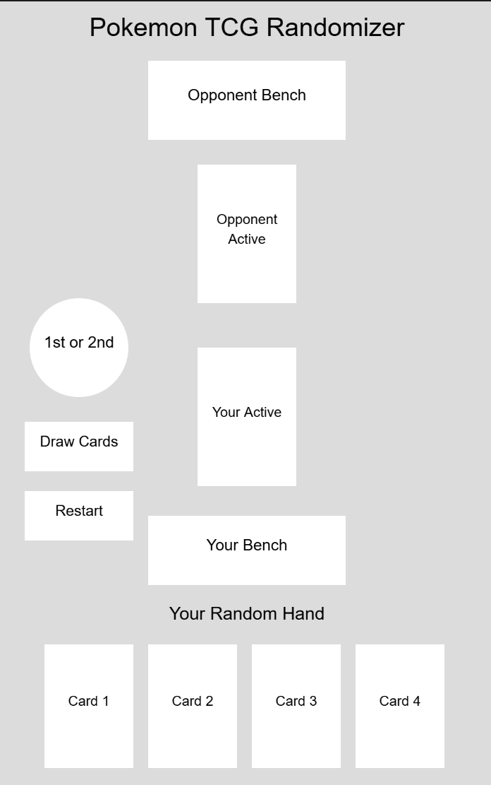
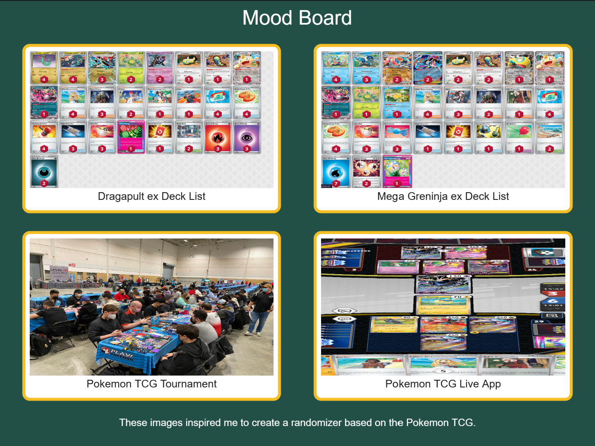

# Project 1: Pokemon TCG Randomizer

## Project Description

This project is a Pokemon TCG randomizer made with p5.js. The user first
clicks the coin to randomly decide who goes first. After that, the user
can draw cards. The program randomly chooses an Active Pokemon for the
user and opponent and gives the user four random cards.

## How to Use

1. Click the coin to see who goes first.
2. Click the Draw Cards button.
3. View both Active Pokemon and your four random cards.
4. Click Restart to try again.

## Wireframe

This wireframe shows my original plan for the layout of the coin,
buttons, Active Pokemon, benches, and random hand.

## Mood Board

My mood board includes two Pokemon deck lists I have used, a competitive
Pokemon event, and a Pokemon TCG Live battle. These images inspired the
theme and layout of my randomizer.

## Live Project

[Click here to play Project 1](https://redskelion.github.io/Art356/MyProject1/)
